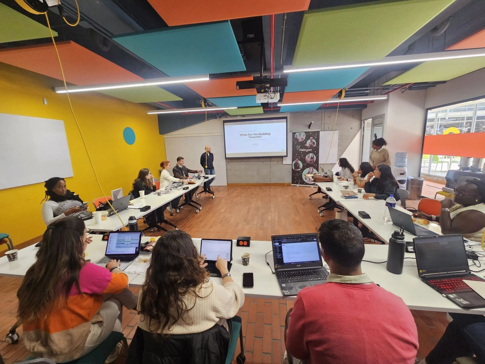
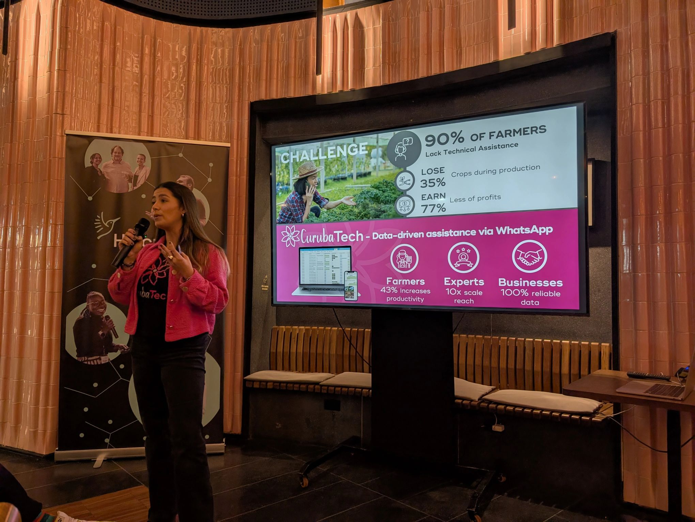
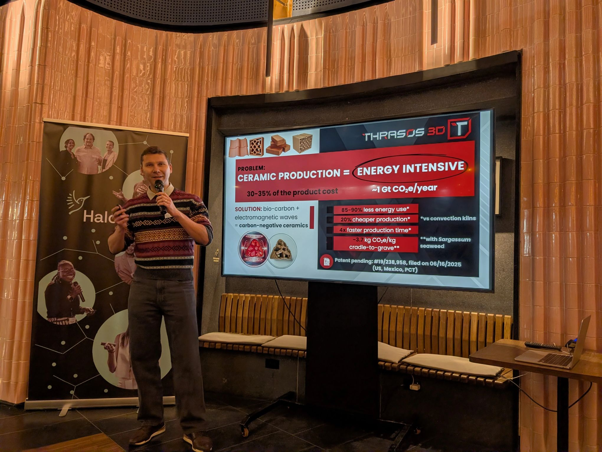
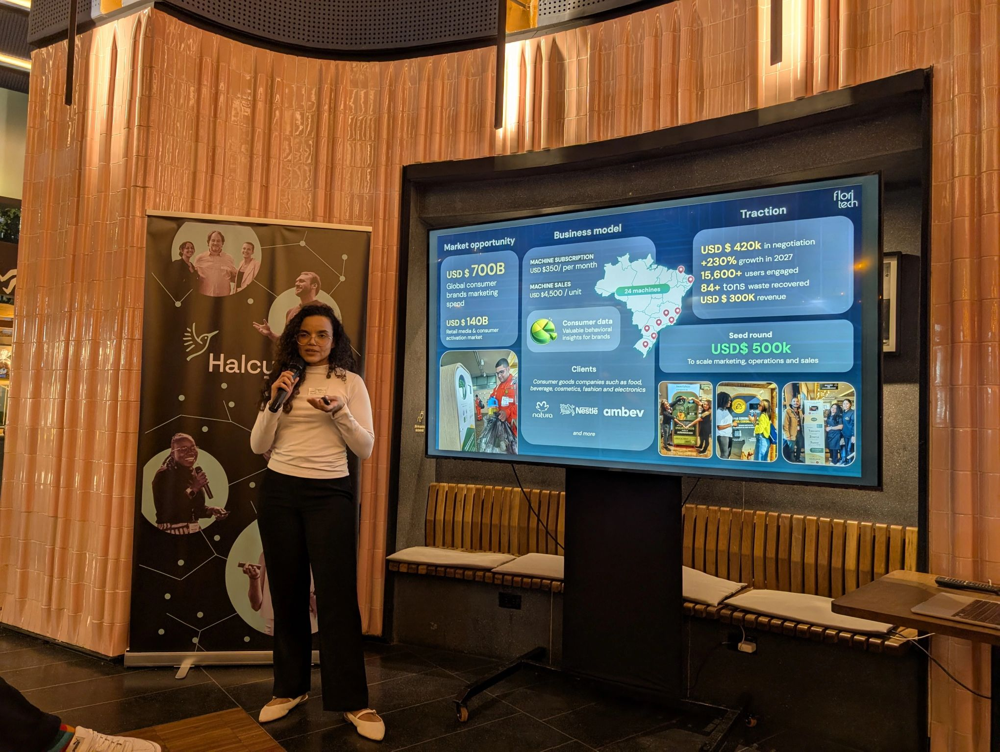
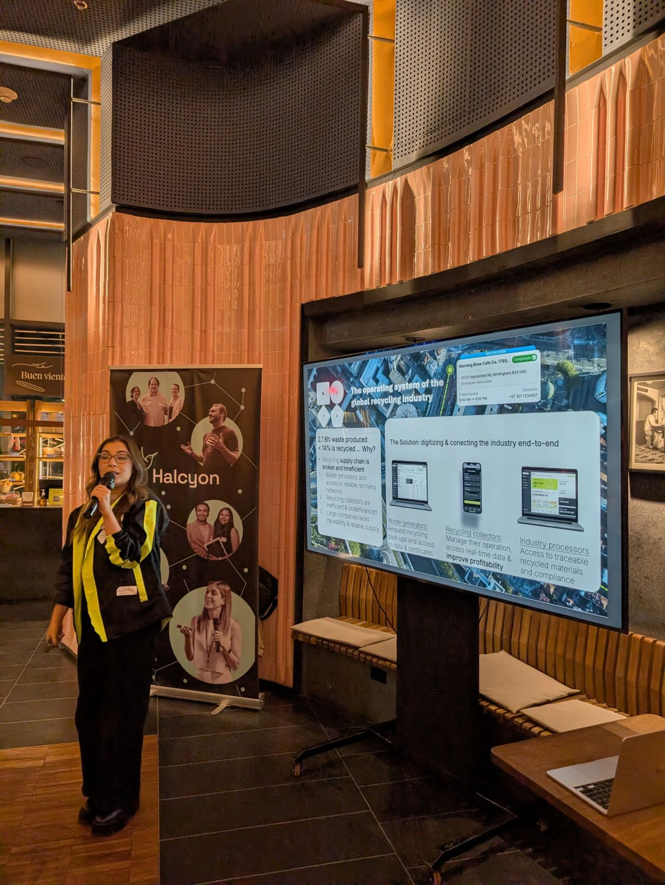
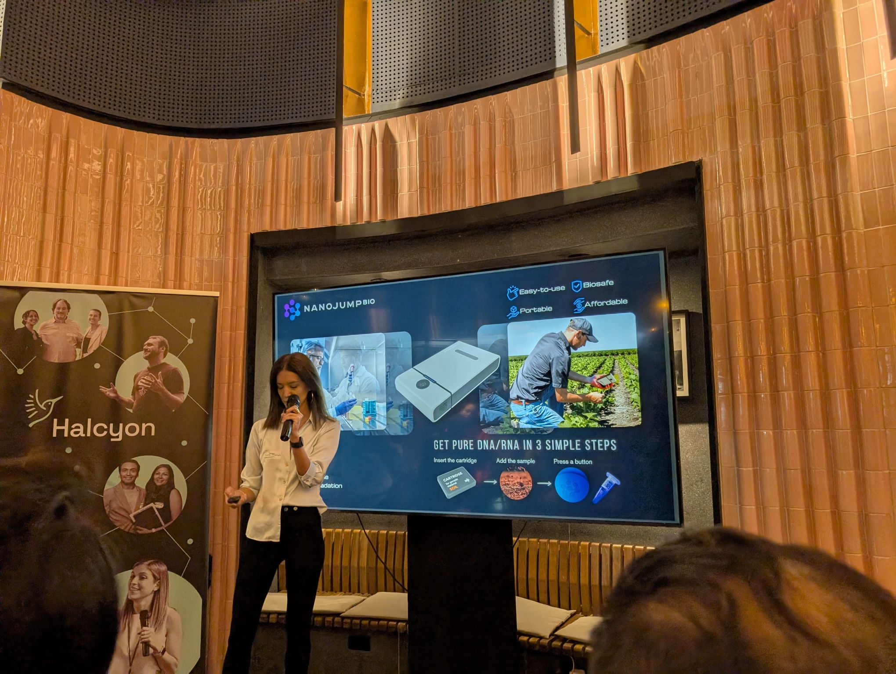
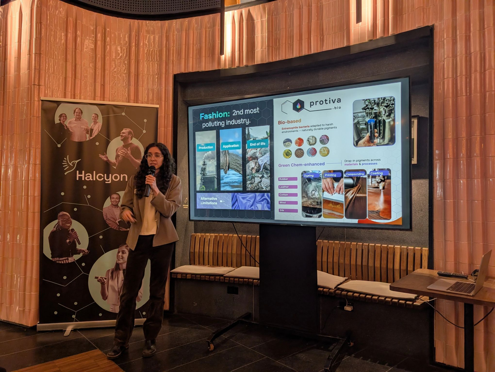

> *Originally posted on [LinkedIn](https://www.linkedin.com/posts/smuriel_hacia-qu%C3%A9-estamos-construyendo-las-decisiones-activity-7440798233083281408-c-Da)*

¿Hacia qué estamos construyendo? ¿Las decisiones que tomamos hoy cuadran con nuestras metas?

Es muy fácil olvidarse de la meta por estar en la neblina de la operación diaria - y de repente podemos dar pasos que se sienten como avanzar pero realmente nos mueven en una dirección diferente a la que queríamos tomar.

Esta semana tuve el honor de estar por segundo vez en el [Halcyon](https://www.linkedin.com/company/halcyonaccelerator/) LAC - programa para emprendedores latinoamericanos en ClimateTech - dando mi charla "Building Towards".

Me apasiona conocer gente con fuego 🔥 y acá hay de sobra - fuego por hacer, por cambiar el mundo con soluciones que literalmente hagan el planeta un lugar mejor.

Mi admiración especial para los que están en DeepTech - creando tecnologías físicas 100% nuevas. Secuenciadores Genéticos portátiles, nuevos materiales, pigmentos biodegradables. Una cosa es hacer software (y hoy mucho más fácil con Claude Code), otra es inventar mecanismos o procesos químicos y físicos nuevos. Increíble.

Ayer fue el cóctel de cierre con flash-pitch de 2 mins. Admiración a todos - pero dejo mis favoritos para que echen ojo:

[Julieta Imperiale](https://linkedin.com/in/julieta-imperiale-09310a69) - secuenciador genético portátil para agro.

[Vasily Korshikov](https://linkedin.com/in/vasily-korshikov) - materiales de construcción a base de bioresiduos.

[Estefanía  Abello Plata, CFA](https://linkedin.com/in/estefania-abello-plata) - software para supply chain de reciclaje.

[Thaís Guerra](https://linkedin.com/in/thais-guerra) - incremento de reciclaje por medio de engagement de consumidor.

[M. Emilia Cardoso Martinez](https://linkedin.com/in/cardoso-emilia) - pigmentos biodegradables para ropa a paridad de precio.

[Paula Aponte](https://linkedin.com/in/paulaaponte) - Asistencia técnica remota y tiempo real para agro.

[Mala Henriques](https://linkedin.com/in/malahenriques) gracias gracias por permitirme poner mi grano de arena en este programa tan espectacular.

