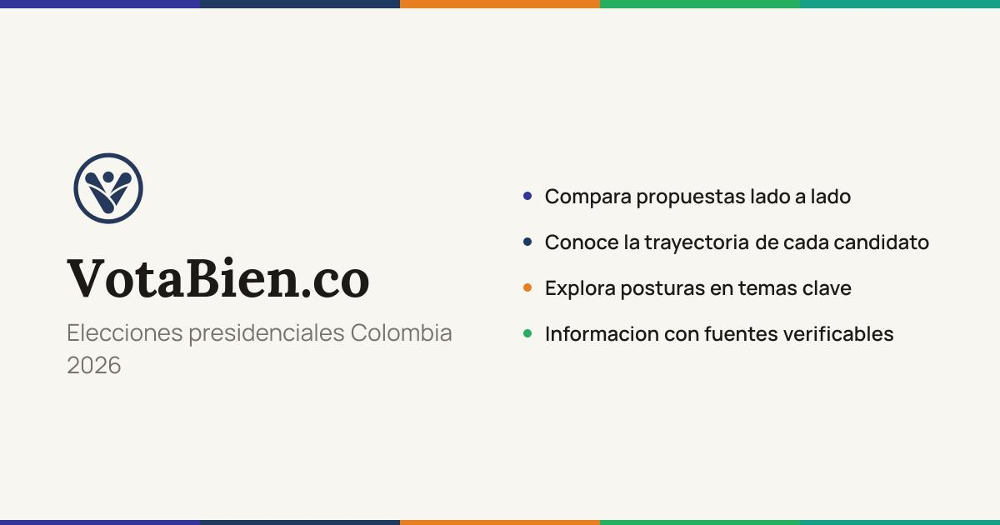

> *Originally posted on [LinkedIn](https://www.linkedin.com/posts/smuriel_votabien-compara-candidatos-presidenciales-activity-7442193801747587072-R5zd)*

Informarme de las propuestas de los candidatos me pareció tenaz (de 2 ni las pude encontrar bien!!) - entonces construí un portal para solucionarlo 🤓

[Votabien.co](http://Votabien.co) - Para comparar las propuestas, trayectorias y posiciones de los candidatos en un solo lugar. Cada frase junto con su fuente a la mano.

Junto a mi amigo Claude saqué las posiciones y propuesta del top 5 de candidatos, para 10 temáticas macro y 14 temas de coyuntura actual.

Con la mayor transparencia posible - todo citado, link a la fuente, mismos prompts para investigar a todos, el orden cambia aleatoriamente durante el día para no darle protagonismo a nadie. Para informar, no convencer ni influir.

Me cuentan cómo lo ven, que más le agregarían (o quitarían), si ven algo mal citado, si creen que sí ayuda o tal vez es una bobada. Con este me emocioné tanto que hasta le saqué dominio 🙈 pero sé que tiene mucho que mejorar.

