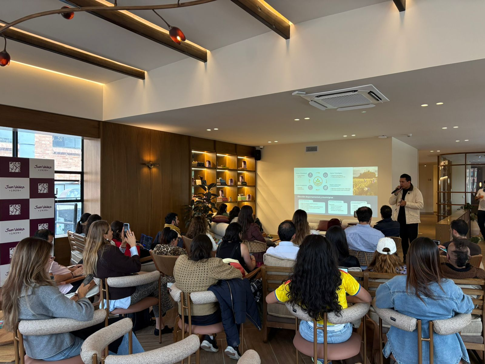

> *Originally posted on [LinkedIn](https://www.linkedin.com/posts/smuriel_las-utop%C3%ADas-s%C3%AD-existen-ya-tenemos-una-en-activity-7443310372930863104-60ua)*

Las utopías sí existen. Ya tenemos una en Colombia.

[Fernando Molano Mateus](https://linkedin.com/in/fernando-molano-mateus-lfmm27) nos lo demostró en 60 minutos con el Proyecto Utopía - educación en agro + emprendimiento orientada 100% al hacer.

Investigando para Ignia, encontré 2 referentes en Colombia que ya se acercaban a lo que queríamos lograr. Utopía y UniEmpresarial.

Utopía es increíble. Es un campus rural - los estudiantes tienen que ir a vivir allí para poder tomar las clases. Queda en Casanare, a 13km de Yopal.

El campus se basa en la práctica, no la teoría - ahí mismo tienen cultivos, animales, maquinaria y demás menesteres de la práctica real del agro.

Los estudiantes aprenden haciendo en el día a día, inmersos en la realidad, no en la teoría.

Hay un nivel de cohesión social increíble. Estudiantes de todos los estratos, con backgrounds muy diferentes.

Formación fuerte en liderazgo y emprendimiento - como hacer productivos los conocimientos y habilidades ganadas.

Una inspiración gigante. Gracias Fer por compartir ayer tanto.

