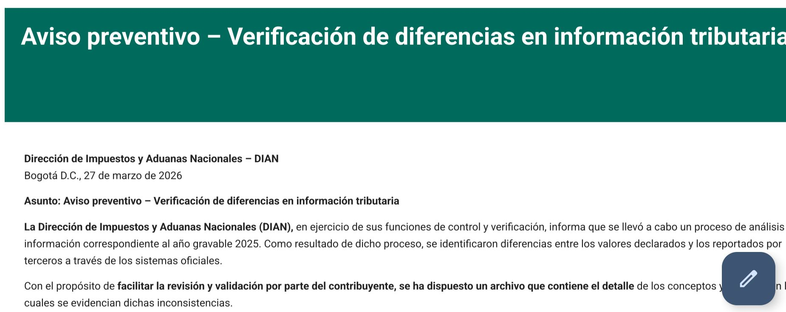
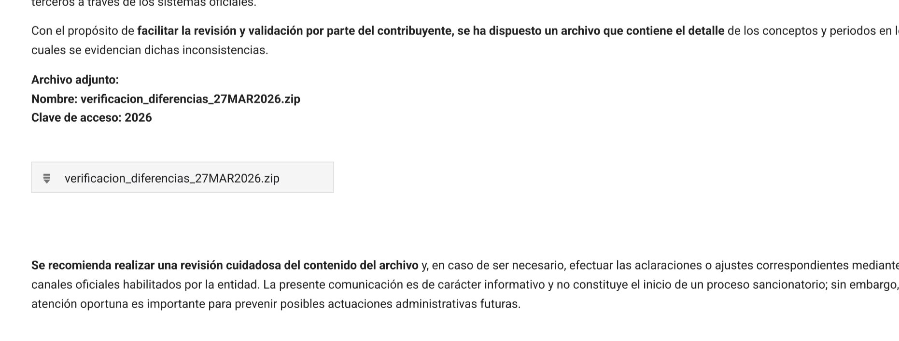

> *Originally posted on [LinkedIn](https://www.linkedin.com/posts/smuriel_me-lleg%C3%B3-el-correo-m%C3%A1s-asustador-del-a%C3%B1o-activity-7443701446006693888-b-2p)*

Me llegó el correo más asustador del año 💀 un requerimiento de la DIAN...

Y menos mal - una estafa. De un correo X (karolina0247**@[gmail.com](http://gmail.com)), sin mi nombre o cédula en el cuerpo, para abrir un .zip con la supuesta irregularidad...

No puedo decir que no sudé frío apenas vi (por algún motivo Gmail no lo mandó a Spam)....

¿Será que cae mucha gente en estas cosas? al menos hubieran sacado un dominio y correo que pareciera de verdad...

Recientemente me han llegado varias otras. Una de impuestos por un supuesto paquete en aduanas, otro de cambio de tarjeta de crédito, otra de que tenía que cambiar mi contraseña de Netflix.

¿Cómo protegerse de estas vainas? siento que un mini descuido o estar de afán y pam, uno cae redondito.

